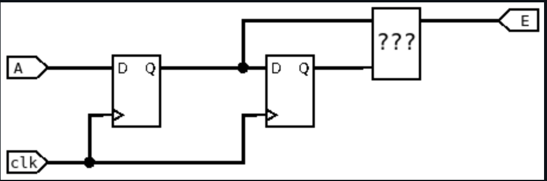
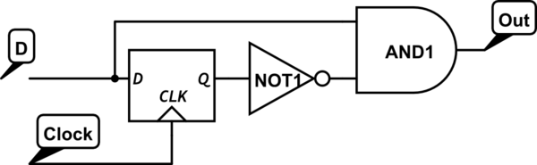

# 📝 README — TP FPGA  
**Auteurs :** Antoine Lemarignier, Louis Vozzzola

## 📌 Présentation du projet
Ce TP a pour objectif de se familiariser avec le développement sur **FPGA**, depuis la description matérielle jusqu’à la synthèse et la mise en œuvre sur carte.

**Matériel et outils utilisés :**
- Carte FPGA : Cyclone V (Altera)
- Langage HDL : VHDL
- Environnement : Quartis / Riscfree


L’objectif principal est de créer un télécran

---

## 🧩 Contenu du TP

### 1. Premier Test
On suit toute la démarche est on arrive bien éteindre la LED quand on appuie sur le bouton :

Cependant, on remarque que la LED est allumé de base et lorsque l'on appuie sur le bouton elle s'éteint. Nous allons faire l'inverse.

On change alors changer notre code en mettant not (pushl), la led s'allume lorsque l'on appuie sur le bouton.


### 2. Faire clignoter une LED


La clock FPGA_CLK1_50 est une clock de 50MHz, et elle est placé sur le pin V11.

On peut alors tracer le schéma équivalent au code :


Cependant ici on ne voit pas le LED clignoté car nous sommes branché directement sur la clock de 50MHz (beaucoup trop rapide pour nous yeux)

Dans la suite, nous allons crée un compteur qui va ramener le clignotement des LEDs à 100ms.
On commence par faire un dessin de ce qu'il nous faut :


Puis en modifiant le code, on obtient après synthesis :


On voit que ca ressemble bien à ce qu'on avait réalisé juste au dessus.

Le _n dans i_rst_n représente negated. Donc par défault il est inversé. Pour l'activer, il faut i_rst_n = 0.

<video controls src="IMG_5914.MOV" title="Title"></video>

### Chenillard
Pour le Chenillard, on reprend ce qui a été fait avant et l'idée va être que tous les 5 000 000 de front montants on va allumer une led différente, et lorsque l'on atteint les 10 LEDs , on revient à la première.


```VHDL
begin

    process(i_clk, i_rst_n)
    begin
        if (i_rst_n = '0') then
            counter <= 0;
            r_led   <= "0000000001"; 
            
        elsif (rising_edge(i_clk)) then
            if (counter = 5000000) then
                counter <= 0;
                r_led <= r_led(8 downto 0) & r_led(9);          
            else
                counter <= counter + 1;
            end if;
        end if;
    end process;

    o_led_vector <= r_led;

end architecture rtl;
```

<video controls src="IMG_5916.mov" title="Title"></video>

## Petit projet : Écran magique

### GESTION DES ENCODEURS
La première partie de ce projet consiste à prendre en main les encodeurs.

Cette structure va nous servir à détecter les front montants / descendants de la clock.



Le composant manquant dans ce schéma est un XOR.

En effet, si on passe d'un état bas à un état haut on aura un front montant. Le signal va d'abord être bas puis haut dans les bascule D donc nous allons avoir un XOR de 1 et 0 donc 1. Si on attend après , les 2 bascules D vont être en haut et donc la sortie redeviendra 0.

Pour détecter seulement les front montants ( par exemple ) on pourra utiliser ce type de schéma :



On implémente cette solution en VHDL :

```VHDL
library ieee;
use ieee.std_logic_1164.all;

entity edge_detector is
    port (
        i_clk : in  std_logic;
        i_a   : in  std_logic;  --  A
        o_e   : out std_logic   --  E
    );
end entity edge_detector;

architecture rtl of edge_detector is
    signal r1_curr : std_logic := '0'; 
    signal r2_prev : std_logic := '0'; --  'b' 

begin
    process(i_clk)
    begin
        if rising_edge(i_clk) then
            r1_curr <= i_a;      
            r2_prev <= r1_curr;  
        end if;
    end process;
	 
    o_e <= r1_curr xor r2_prev;

end architecture rtl;
```
<div style="display: flex; gap: 20px;">
  
  
</div>

<br>


Sur Modelsim, on simule notre composant pour voir si il fonctionne comme on veut : 


On voit bien la détection des fronts montants et descendant

On peut tester notre encodeur, en faisant un code qui compte de 1 et l'affiche en binaire à travers les LEDs à chaque fois que l'on tourne le potentiomètre:

<video controls src="IMG_5980.mov" title="Title"></video>

```VHDL
library ieee;
use ieee.std_logic_1164.all;
use ieee.numeric_std.all;

entity encodeur is
    generic (
        C_WIDTH : integer := 10
    );
    port (
        i_clk        : in std_logic;
        i_rst_n      : in std_logic;
        i_a          : in std_logic;
        i_b          : in std_logic;
        o_led_vector : out std_logic_vector(C_WIDTH-1 downto 0) 
    );
end entity encodeur;

architecture rtl of encodeur is
    signal r_a_curr, r_a_prev : std_logic;
    signal r_b_curr, r_b_prev : std_logic;
    signal r_counter : unsigned(C_WIDTH-1 downto 0) := (others => '0');

    -- Signaux pour l'anti-rebond (Debounce)
    -- On veut échantillonner environ toutes les 2ms.
    -- Horloge 50MHz = 20ns. 
    -- 2ms / 20ns = 100 000 cycles.
    constant C_DEBOUNCE_LIMIT : integer := 100000; 
    signal r_debounce_cnt     : integer range 0 to C_DEBOUNCE_LIMIT := 0;
    signal r_tick_enable      : std_logic := '0';

begin

    -------------------------------------------------------------------------
    -- 1. GÉNÉRATEUR DE TICK (Anti-Rebond)
    -- Ce process crée une impulsion 'r_tick_enable' toutes les 2ms.
    -------------------------------------------------------------------------
    process(i_clk, i_rst_n)
    begin
        if i_rst_n = '0' then
            r_debounce_cnt <= 0;
            r_tick_enable  <= '0';
        elsif rising_edge(i_clk) then
            if r_debounce_cnt = C_DEBOUNCE_LIMIT then
                r_debounce_cnt <= 0;
                r_tick_enable  <= '1'; -- On autorise la lecture
            else
                r_debounce_cnt <= r_debounce_cnt + 1;
                r_tick_enable  <= '0';
            end if;
        end if;
    end process;

    -------------------------------------------------------------------------
    -- 2. LOGIQUE ENCODEUR (Synchronisée sur le Tick)
    -------------------------------------------------------------------------
    process(i_clk, i_rst_n)
    begin
        if i_rst_n = '0' then
            r_counter <= (others => '0');
            r_a_curr <= '0'; r_a_prev <= '0';
            r_b_curr <= '0'; r_b_prev <= '0';
            
        elsif rising_edge(i_clk) then
            
            -- ON NE FAIT RIEN TANT QUE LE TICK N'EST PAS LA
            if r_tick_enable = '1' then
            
                -- On capture les entrées UNIQUEMENT à ce moment là
                r_a_curr <= i_a; r_a_prev <= r_a_curr;
                r_b_curr <= i_b; r_b_prev <= r_b_curr;

                -- Logique d'incrémentation
                if (r_a_curr = '1' and r_a_prev = '0' and r_b_curr = '0') or
                   (r_a_curr = '0' and r_a_prev = '1' and r_b_curr = '1') then
                    r_counter <= r_counter + 1;
                
                -- Logique de décrémentation
                elsif (r_b_curr = '1' and r_b_prev = '0' and r_a_curr = '0') or
                      (r_b_curr = '0' and r_b_prev = '1' and r_a_curr = '1') then
                    r_counter <= r_counter - 1;
                end if;
                
            end if; -- Fin du if tick_enable
            
        end if;
    end process;
    
    o_led_vector <= std_logic_vector(r_counter);

end architecture rtl;
```

**Contrôleur HDMI**

On refait le fichier hdmi_controler , et on peut donc changer ce qui s'affiche à l'écran :


L'effet à l'écran vient car dans notre code on a :

Rouge varie horizontalement (selon x)

Vert varie verticalement (selon y)

Bleu est constant à 0

Donc du bit 23 à 16  on aura le rouge , de 15 à 8 ça sera le vert puis de 7 à 0 le bleu. Grâce à la combinaison de ce vecteur, on va pouvoir créer n'importe quelle couleur.

## Déplacement d'un pixel
On crée le code qui va pouvoir déplacer le pixel seul. Pour se faire, on va juste incrémenter 2 compteurs , un pour l'horizontal et un pour la vertical. Et donc à chaque front montant, on va garder en mémoire la valeur X et Y de notre pointeur , et les changer si on touche aux 2 encodeurs.

<video controls src="528555457-c5d05790-0866-4dea-bc2f-7f806b71dd6d.mp4" title="Title"></video>
```VHDL
library ieee;
use ieee.std_logic_1164.all;
use ieee.numeric_std.all;

entity hdmi_controler is
    generic (
        H_RES : natural := 720;
        V_RES : natural := 480
    );
    port (
        i_clk   : in  std_logic;  -- horloge pixel 27 MHz
        i_rst_n : in  std_logic;
		  i_X : in natural;
		  i_Y : in natural;

        -- HDMI output
        o_hdmi_tx_clk : out std_logic;
        o_hdmi_tx_d   : out std_logic_vector(23 downto 0);
        o_hdmi_tx_de  : out std_logic;
        o_hdmi_tx_hs  : out std_logic;
        o_hdmi_tx_vs  : out std_logic
    );
end entity hdmi_controler;

architecture rtl of hdmi_controler is

    -- Timings 480p (720x480 @ 60 Hz)
    constant H_FP    : natural := 16;
    constant H_PW    : natural := 62;
    constant H_BP    : natural := 60;
    constant H_TOTAL : natural := H_RES + H_FP + H_PW + H_BP;

    constant V_FP    : natural := 9;
    constant V_PW    : natural := 6;
    constant V_BP    : natural := 30;
    constant V_TOTAL : natural := V_RES + V_FP + V_PW + V_BP;

    signal h_cnt : natural range 0 to H_TOTAL-1 := 0;
    signal v_cnt : natural range 0 to V_TOTAL-1 := 0;

    signal de_int : std_logic;

begin

    ------------------------------------------------------------------
    -- Horloge pixel HDMI
    ------------------------------------------------------------------
    o_hdmi_tx_clk <= i_clk;

    ------------------------------------------------------------------
    -- Compteurs horizontal / vertical
    ------------------------------------------------------------------
    process(i_clk)
    begin
        if rising_edge(i_clk) then
            if i_rst_n = '0' then
                h_cnt <= 0;
                v_cnt <= 0;
            else
                if h_cnt = H_TOTAL-1 then
                    h_cnt <= 0;
                    if v_cnt = V_TOTAL-1 then
                        v_cnt <= 0;
                    else
                        v_cnt <= v_cnt + 1;
                    end if;
                else
                    h_cnt <= h_cnt + 1;
                end if;
            end if;
        end if;
    end process;

    ------------------------------------------------------------------
    -- Synchronisations HDMI
    ------------------------------------------------------------------
    o_hdmi_tx_hs <= '0'
        when (h_cnt >= H_RES + H_FP and h_cnt < H_RES + H_FP + H_PW)
        else '1';

    o_hdmi_tx_vs <= '0'
        when (v_cnt >= V_RES + V_FP and v_cnt < V_RES + V_FP + V_PW)
        else '1';

    ------------------------------------------------------------------
    -- Data Enable (zone visible)
    ------------------------------------------------------------------
    de_int <= '1' when (h_cnt < H_RES and v_cnt < V_RES) else '0';
    o_hdmi_tx_de <= de_int;

    ------------------------------------------------------------------
    -- Génération des pixels
    -- fond blanc + carré noir 10x10
    ------------------------------------------------------------------
    o_hdmi_tx_d <=
        -- carré noir
        (others => '0')
            when (de_int = '1' and
                  h_cnt >= i_X and h_cnt < i_X + 5 and
                  v_cnt >= i_Y and v_cnt < i_Y +5 ) else

        -- fond blanc
        (x"FF" & x"FF" & x"FF")
            when de_int = '1' else

        -- hors zone active
        (others => '0');

end architecture rtl;
```
## Mémoriser 
La mémorisation des points est un peu plus complexe, car elle fait appel une mémoire RAM. Dans notre cas, nous allons utiliser une mémoire RAM dual-port. Le but de la mémoire RAM dual-port est d'avoir un accés en écriture et en lecture en même temps ce qui permet de gagner du temps !

Chaque case du tableau est en fait une cellule de la mémoire dual-port (DPRAM), qui permet de lire et d’écrire les pixels simultanément sur deux ports différents : un port pour mémoriser les pixels allumés (écriture) et un port pour les afficher à l’écran (lecture). Cela permet de conserver l’état de chaque pixel et de reconstruire l’image à chaque balayage sans perdre les données déjà écrites


```VHDL
--mémoire
	-- Calcul de l'adresse d'écriture =
    s_ram_addr_write <= s_pos_y * h_res + s_pos_x;
    
    -- Calcul de l'adresse de lecture 
    --  On convertit les unsigned en integer pour le calcul
    s_ram_addr_read  <= to_integer(s_scan_y) * h_res + to_integer(s_scan_x);

    --  DPRAM
    inst_PORT_AB : component dpram
    generic map (
        mem_size    => h_res * v_res, 
        data_width  => C_RAM_DATA_WIDTH -- 1 bit par pixel
    )
    port map (    
        -- PORT A : Horloge 50MHz
        i_clk_a  => i_clk_50,
        i_addr_a => s_ram_addr_write,
        i_data_a => "1",    
        i_we_a   => '1',   
        -- o_q_a non connecté

        -- PORT B : Horloge 27MHz
        i_clk_b  => s_clk_27,
        i_addr_b => s_ram_addr_read,
        i_data_b => (others => '0'), 
        i_we_b   => '0',             -- Lecture seule
        o_q_b    => s_ram_q_b        
    );


    -- AFFICHAGE FINAL

    process(s_scan_x, s_scan_y, s_pos_x, s_pos_y, s_de, s_ram_q_b)
        variable v_scan_x_int : integer;
        variable v_scan_y_int : integer;
    begin
        v_scan_x_int := to_integer(s_scan_x);
        v_scan_y_int := to_integer(s_scan_y);

        if s_de = '1' then
            if (v_scan_x_int >= s_pos_x and v_scan_x_int < s_pos_x + 16) and
               (v_scan_y_int >= s_pos_y and v_scan_y_int < s_pos_y + 16) then
                o_hdmi_tx_d <= x"FF0000"; -- Curseur ROUGE pour le distinguer du trait
            
            elsif s_ram_q_b(0) = '1' then
                o_hdmi_tx_d <= x"FFFFFF"; -- Trait BLANC 
                
            else
                o_hdmi_tx_d <= x"000050"; -- Fond Bleu Foncé
            end if;
        else
            o_hdmi_tx_d <= (others => '0');
        end if;
    end process;
```

## Effacement

Pour l'effacement, nous allons une petite "machine à états" :

État IDLE : On attend. Si on appuie sur le bouton, on passe à l'état CLEAR.

État CLEAR : Un compteur défile de 0 à la fin de la mémoire. À chaque cycle d'horloge, on écrit 0. Une fois fini, on retourne à IDLE.

Il faut donc placer un Multiplexeur juste avant l'entrée de la RAM pour choisir qui (des encodeurs ou du compteur) a le droit de parler à la mémoire.

```VHDL
library ieee;
use ieee.std_logic_1164.all;
use ieee.numeric_std.all;

library pll;
use pll.all;

entity telecran is
    port (
        -- FPGA
        i_clk_50 : in std_logic;

        -- HDMI
        io_hdmi_i2c_scl : inout std_logic;
        io_hdmi_i2c_sda : inout std_logic;
        o_hdmi_tx_clk   : out std_logic;
        o_hdmi_tx_d     : out std_logic_vector(23 downto 0);
        o_hdmi_tx_de    : out std_logic;
        o_hdmi_tx_hs    : out std_logic;
        i_hdmi_tx_int   : in std_logic;
        o_hdmi_tx_vs    : out std_logic;

        -- KEYs
        i_rst_n : in std_logic;

        -- LEDs
        o_leds : out std_logic_vector(9 downto 0);
        o_de10_leds : out std_logic_vector(7 downto 0);

        -- Coder
        i_left_ch_a : in std_logic; -- Axe X
        i_left_ch_b : in std_logic;
        i_left_pb   : in std_logic; -- Bouton pour effacer
        i_right_ch_a : in std_logic; -- Axe Y
        i_right_ch_b : in std_logic;
        i_right_pb   : in std_logic
    );
end entity telecran;

architecture rtl of telecran is

    component I2C_HDMI_Config 
        port (
            iCLK : in std_logic;
            iRST_N : in std_logic;
            I2C_SCLK : out std_logic;
            I2C_SDAT : inout std_logic;
            HDMI_TX_INT  : in std_logic
        );
    end component;
    
    component pll 
        port (
            refclk : in std_logic;
            rst : in std_logic;
            outclk_0 : out std_logic;
            locked : out std_logic
        );
    end component;
    
     component dpram
    generic (
        mem_size    : natural := 720 * 480;
        data_width  : natural := 8
    );
    port (    
        i_clk_a     : in std_logic;
        i_clk_b     : in std_logic;
        i_data_a    : in std_logic_vector(data_width-1 downto 0);
        i_data_b    : in std_logic_vector(data_width-1 downto 0);
        i_addr_a    : in natural range 0 to mem_size-1;
        i_addr_b    : in natural range 0 to mem_size-1;
        i_we_a      : in std_logic := '1';
        i_we_b      : in std_logic := '1';
        o_q_a       : out std_logic_vector(data_width-1 downto 0);
        o_q_b       : out std_logic_vector(data_width-1 downto 0)
    );
    end component;

    constant h_res : natural := 720;
    constant v_res : natural := 480;
    constant C_MEM_SIZE : natural := h_res * v_res;

    signal s_clk_27 : std_logic;
    signal s_rst_n : std_logic;
    
    -- Signaux HDMI
    signal s_scan_x : unsigned(11 downto 0);
    signal s_scan_y : unsigned(11 downto 0);
    signal s_de     : std_logic; 

    -- Signaux Position Curseur
    signal s_pos_x  : integer range 0 to H_RES-1;
    signal s_pos_y  : integer range 0 to V_RES-1;

    -- Signaux RAM
    constant C_RAM_DATA_WIDTH : integer := 1;
    
    -- Adresses "Candidats" (ceux qui veulent accéder à la RAM)
    signal s_ram_addr_draw  : natural range 0 to C_MEM_SIZE-1;
    signal s_ram_addr_read  : natural range 0 to C_MEM_SIZE-1;
    
    -- Signaux internes RAM
    signal s_ram_q_b        : std_logic_vector(C_RAM_DATA_WIDTH-1 downto 0);
    
    ----------------------------------------------------------------------
    -- SIGNAUX POUR L'EFFACEMENT (MACHINE A ETATS)
    ----------------------------------------------------------------------
    type t_state is (IDLE, CLEAR);
    signal s_state : t_state := IDLE;
    
    -- Compteur pour parcourir toute la RAM
    signal s_clear_cnt : natural range 0 to C_MEM_SIZE-1 := 0;
    
    -- Signaux finaux envoyés à la RAM (après multiplexage)
    signal s_final_addr_a : natural range 0 to C_MEM_SIZE-1;
    signal s_final_data_a : std_logic_vector(C_RAM_DATA_WIDTH-1 downto 0);

begin
    o_leds <= (others => '0');
    o_de10_leds <= (others => '0');
    
    pll0 : component pll 
        port map (
            refclk => i_clk_50,
            rst => not(i_rst_n),
            outclk_0 => s_clk_27,
            locked => s_rst_n
        );

    I2C_HDMI_Config0 : component I2C_HDMI_Config 
        port map (
            iCLK => i_clk_50,
            iRST_N => i_rst_n,
            I2C_SCLK => io_hdmi_i2c_scl,
            I2C_SDAT => io_hdmi_i2c_sda,
            HDMI_TX_INT => i_hdmi_tx_int
        );
    
    hdmi_controler : entity work.hdmi_controler
    generic map ( H_RES => 720, V_RES => 480 )
    port map (
        i_clk   => s_clk_27,
        i_rst_n => s_rst_n,
        o_x => s_scan_x,
        o_y => s_scan_y,  
        o_hdmi_tx_clk  => o_hdmi_tx_clk,
        o_hdmi_tx_de   => s_de,
        o_hdmi_tx_hs   => o_hdmi_tx_hs,
        o_hdmi_tx_vs   => o_hdmi_tx_vs
    );
    o_hdmi_tx_de <= s_de;
    
    -- Encodeurs
    inst_encoder_x : entity work.gestion_encodeur
    generic map ( C_MAX_VAL => h_res, C_START_POS => h_res / 2 )
    port map ( i_clk => i_clk_50, i_rst_n => s_rst_n, i_a => i_left_ch_a, i_b => i_left_ch_b, o_val => s_pos_x );

    inst_encoder_y : entity work.gestion_encodeur
    generic map ( C_MAX_VAL => v_res, C_START_POS => v_res / 2 )
    port map ( i_clk => i_clk_50, i_rst_n => s_rst_n, i_a => i_right_ch_a, i_b => i_right_ch_b, o_val => s_pos_y );

    -- ========================================================================
    -- LOGIQUE DE GESTION MÉMOIRE (DESSIN + EFFACEMENT)
    -- ========================================================================
    
    -- 1. Calcul des adresses de base
    s_ram_addr_draw <= s_pos_y * h_res + s_pos_x;
    s_ram_addr_read <= to_integer(s_scan_y) * h_res + to_integer(s_scan_x);

    -- 2. Machine à états pour l'effacement
    process(i_clk_50, s_rst_n)
    begin
        if s_rst_n = '0' then
            s_state <= IDLE;
            s_clear_cnt <= 0;
        elsif rising_edge(i_clk_50) then
            case s_state is
                when IDLE =>
                    -- Si bouton appuyé (actif bas '0'), on lance l'effacement
                    if i_left_pb = '0' then
                        s_state <= CLEAR;
                        s_clear_cnt <= 0;
                    end if;
                    
                when CLEAR =>
                    -- On incrémente le compteur jusqu'à la fin de la mémoire
                    if s_clear_cnt = C_MEM_SIZE - 1 then
                        s_state <= IDLE; -- Fini !
                        s_clear_cnt <= 0;
                    else
                        s_clear_cnt <= s_clear_cnt + 1;
                    end if;
            end case;
        end if;
    end process;

    -- 3. Multiplexeur (Choix entre Dessin et Effacement)
    -- Si on est en mode CLEAR, l'adresse vient du compteur et la donnée est 0
    -- Sinon, l'adresse vient des encodeurs et la donnée est 1
    s_final_addr_a <= s_clear_cnt when s_state = CLEAR else s_ram_addr_draw;
    s_final_data_a <= "0"         when s_state = CLEAR else "1";

    -- 4. Instanciation RAM
    inst_PORT_AB : component dpram
    generic map (
        mem_size    => C_MEM_SIZE,
        data_width  => C_RAM_DATA_WIDTH
    )
    port map (    
        -- PORT A : Connecté à nos signaux multiplexés (s_final_...)
        i_clk_a  => i_clk_50,
        i_addr_a => s_final_addr_a,
        i_data_a => s_final_data_a,
        i_we_a   => '1', -- On écrit tout le temps (soit du blanc, soit du noir)

        -- PORT B : Lecture HDMI (Inchangé)
        i_clk_b  => s_clk_27,
        i_addr_b => s_ram_addr_read,
        i_data_b => (others => '0'),
        i_we_b   => '0',
        o_q_b    => s_ram_q_b
    );

    -- ========================================================================
    -- AFFICHAGE FINAL
    -- ========================================================================
    process(s_scan_x, s_scan_y, s_pos_x, s_pos_y, s_de, s_ram_q_b)
        variable v_scan_x_int : integer;
        variable v_scan_y_int : integer;
    begin
        v_scan_x_int := to_integer(s_scan_x);
        v_scan_y_int := to_integer(s_scan_y);

        if s_de = '1' then
            -- Curseur Rouge
            if (v_scan_x_int >= s_pos_x and v_scan_x_int < s_pos_x + 16) and
               (v_scan_y_int >= s_pos_y and v_scan_y_int < s_pos_y + 16) then
                o_hdmi_tx_d <= x"FF0000"; 
            
            -- Trait Blanc (lu depuis la RAM)
            elsif s_ram_q_b(0) = '1' then
                o_hdmi_tx_d <= x"FFFFFF"; 
                
            -- Fond Bleu Foncé
            else
                o_hdmi_tx_d <= x"000050"; 
            end if;
        else
            o_hdmi_tx_d <= (others => '0');
        end if;
    end process;
end architecture rtl;
```
<video controls src="video_telecran.mp4" title="Title"></video>
