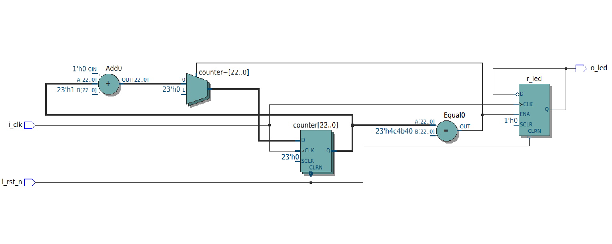

# 📝 README — TP FPGA  
**Auteurs :** Antoine Lemarignier, Louis Vozzzola

## 📌 Présentation du projet
Ce TP a pour objectif de se familiariser avec le développement sur **FPGA**, depuis la description matérielle jusqu’à la synthèse et la mise en œuvre sur carte.

**Matériel et outils utilisés :**
- Carte FPGA : *(à compléter, ex : Basys 3 / Nexys A7 / DE10-Lite...)*
- Langage HDL : *(VHDL / Verilog)*
- Environnement : *(Vivado / Quartus)*

L’objectif principal est d’apprendre à concevoir un circuit numérique, le simuler et le déployer sur FPGA.

---

## 🧩 Contenu du TP

### 1. Premier Test
On suit toute la démarche est on arrive bien éteindre la LED quand on appuie sur le bouton :

On change alors notre en code en mettant not pushl, la led s'allume lorsque l'on appuie sur le bouton.

### 2. Faire clignoter une LED

La clock FPGA_CLK1_50 est une 50MHz, et elle est placé sur le pin V11.

6. On peut réaliser 

7. On peut réaliser une première ébauche du compteur :

8. 

11. Le _n dans i_rst_n représente negated. Donc par défault il est inversé. Pour l'activer, il faut i_rst_n = 0.

Gestion des encodeurs

### 3. Simulation
- Création de testbenches.
- 

- 
'''VHDL
library ieee;
use ieee.std_logic_1164.all;

entity edge_detector is
    port (
        i_clk : in  std_logic;
        i_a   : in  std_logic;  --  A
        o_e   : out std_logic   --  E
    );
end entity edge_detector;

architecture rtl of edge_detector is
    signal r1_curr : std_logic := '0'; 
    signal r2_prev : std_logic := '0'; --  'b' 

begin
    process(i_clk)
    begin
        if rising_edge(i_clk) then
            r1_curr <= i_a;      
            r2_prev <= r1_curr;  
        end if;
    end process;
	 
    o_e <= r1_curr xor r2_prev;

end architecture rtl;
'''

- Vérification fonctionnelle.

### 4. Synthèse & Implémentation
- Synthèse.
- Placement & routage.
- Résolution des warnings/erreurs.

### 5. Téléversement sur FPGA
- Génération du bitstream.
- Programmation de la carte.

### 6. Tests et validation
- Comparaison simulation vs matériel.
- Analyse des écarts éventuels.

---

## 📂 Arborescence du projet
