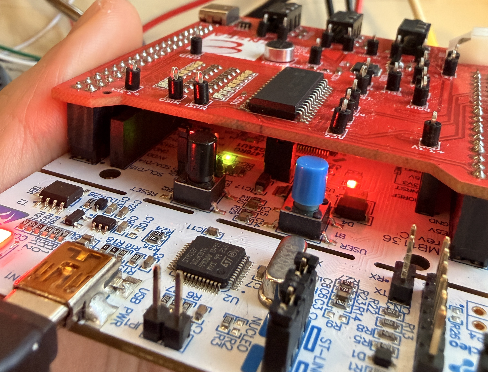

# ESE_VOZ_LEM
# 📘 TP 1– README AUTO RADIO

Bienvenue dans le dépôt de notre premier  **TP**.  
Chaque dossier correspond à un TP individuel avec son propre fichier `README.md` décrivant le contenu, les objectifs et les instructions spécifiques.

# 🟢 1. Démarrage

1. **Créez un nouveau projet** pour la carte **NUCLEO-L476RG**.  
   Initialisez les périphériques avec leurs **modes par défaut**, mais **n’activez pas la BSP**.

2. **Testez la LED LD2** (connectée à la broche **PA5**) avec le code suivant :

   ```c
   while (1)
   {
       // Question 2 : Clignotement de la LED LD2
       HAL_GPIO_TogglePin(GPIOA, GPIO_PIN_5);
       HAL_Delay(1000); // Délai de 1 seconde
   }


3 et 4. **Testez l’USART2** connecté à la **ST-Link interne**.

   ```c
   /* USER CODE BEGIN 0 */
   int __io_putchar(int ch) {
       HAL_UART_Transmit(&huart2, (uint8_t *)&ch, 1, HAL_MAX_DELAY);
       return ch;
   }
   /* USER CODE END 0 */


   /* USER CODE BEGIN 2 */
   printf("Bonjour Antonio y Louis\r\n");
   /* USER CODE END 2 */

  

5. **Activez FreeRTOS** en mode CMSIS V1.


##2 Le GPIO Expander et le VU-Metre
###2.1 Configuration
