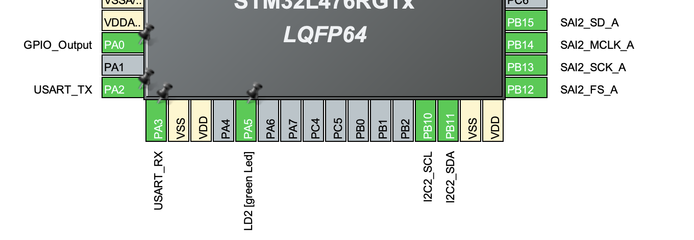

<h1>📘 TP1 – AUTO RADIO</h1>
<h3>Projet ESE_VOZ_LEM</h3>

Bienvenue dans le dépôt de notre premier <strong>Travail Pratique (TP1)</strong>. 
Ce projet est basé sur la carte <strong>NUCLEO-L476RG</strong> et a pour but d’explorer la configuration matérielle de base, 
le contrôle GPIO, la communication UART, et l’utilisation de FreeRTOS.

<h2>🟢 1. Démarrage</h2>

<h3>Étape 1 — Création du projet</h3>
<ol>
  <li>Créez un <strong>nouveau projet</strong> pour la carte <strong>NUCLEO-L476RG</strong>.</li>
  <li>Initialisez les périphériques avec leurs <strong>modes par défaut</strong>, mais <strong>n’activez pas la BSP</strong>.</li>
</ol>

<h3>Étape 2 — Test de la LED LD2</h3>

La LED <strong>LD2</strong> est connectée à la broche <strong>PA5</strong>. 
Ajoutez le code suivant dans la boucle principale :

<pre><code class="language-c">
while (1)
{
    // Question 2 : Clignotement de la LED LD2
    HAL_GPIO_TogglePin(GPIOA, GPIO_PIN_5);
    HAL_Delay(1000); // Délai de 1 seconde
}
</code></pre>

📸 <strong>LED LD2 en fonctionnement :</strong>

  

<h3>Étape 3 & 4 — Test de l’USART2 (ST-Link interne)</h3>

L’<strong>USART2</strong> est utilisé pour communiquer via le port série intégré à la carte. 
Ajoutez le code suivant pour rediriger <code>printf()</code> vers l’UART :

<pre><code class="language-c">
/* USER CODE BEGIN 0 */
int __io_putchar(int ch) {
    HAL_UART_Transmit(&huart2, (uint8_t *)&ch, 1, HAL_MAX_DELAY);
    return ch;
}
/* USER CODE END 0 */

/* USER CODE BEGIN 2 */
printf("Bonjour Antonio y Louis\r\n");
/* USER CODE END 2 */
</code></pre>

<strong>Sortie série visible dans le terminal :</strong>

  

<h3>Étape 5 — Activation de FreeRTOS</h3>

Activez <strong>FreeRTOS</strong> via <strong>CMSIS V1</strong>. 

<h3>6. Faites fonctionner le shell :</h3>

Le projet est dans Dossier Shell

<h2>🔵 2. Le GPIO Expander et le VU-Mètre</h2>

<h3>2.1 Configuration</h3>
Le GPIO Expander est le MCP23S17 et sa datasheet est téléchargé dans le dossier Datasheet.
En regardant le schématic du shield et en comparant le .ioc, on en déduit que le SPI utilisé est le 3ème (SPI3)

  
  
  

<h3>2.2 Tests</h3>
On peut alors tester le GPIO Extander en allumant quelques LEDS, pour ce faire on crée un driver qui va nous permettre de commander l'extander. On comprend que pour communiquer avec le GPIO Extander, il faut le sélectionner grâce au pin CS (ChipSelect) et qu'il faut aussi utiliser le pin RST (Reset).

On crée alors un driver qui va nous permettre d'initialiser le GPIO Extander mais aussi de sélectionner l'état de chaque pin :
<pre><code class="language-c">
void Task_LED(void const *argument)
{
    (void)argument;  // Si tu utilises osThread
    for(;;)
    {
    	Select_LED('A', 1,1);
    	Select_LED('A', 0,1);
    	Select_LED('A', 7,1);
    	vTaskDelay(200);
    	Select_LED('A', 1,0);
		  Select_LED('A', 0,1);
		  Select_LED('A', 7,0);
    	vTaskDelay(200);
    }
}
</code></pre>
<pre><code class="language-c">
// Allume une LED spécifique (0 à 15)
void Select_LED(char port, uint8_t led,uint8_t state)
{
    if (led > 7) return;
    uint8_t reg = (port == 'A' || port == 'a') ? MCP23S17_GPIOA : MCP23S17_GPIOB;
    uint8_t current = MCP23S17_ReadRegister(reg);
    // On part du principe que tout est allumé (0xFF)
    // On force un seul bit à 0 → éteint la LED
    if (state == 1)
    {
        uint8_t pattern = 0xFF;           // 11111111
        current &= ~(1 << led);           // Met le bit `led` à 0
    }
    if (state == 0)
	{
		uint8_t pattern = 0xFF;           // 11111111
		current |= (1 << led);           // Met le bit `led` à 0
	}
    MCP23S17_WriteRegister(reg, current);
}
</code></pre>
En testant, on se rend compte pour que pour avoir une sortie à l'état haut, il faut mettre 0 dans le registre concerné.
On voit que ca marche bien :

  

<h2>2.3 Driver</h2>
On crée alors une nouvelle fonction LED qui va être inclu dans le shell et qui va nous permettre d'allumer n'importe quelle LED grâce à une commande :

</code></pre>
<pre><code class="language-c">
>L 15 1
</code></pre>
Le L fait appel à la fonction LED, le 15 signifie la 15ème LED et le 1 est l'état de la LED (allumer ou éteint)

<h2>3 Le CODEC Audio SGTL5000</h2>
<h2>3.1 Configuration préalables</h2>
En regardant le schematic, on voit bien que l'on va devoir travailler avec l'I2C2 (PB10 - SCL et PB11 - SDA) 

<h2>3.2 Configuration du CODEC par l’I2C</h2>
On regarde l'horloge MCLK :

L'horloge MCLK sert une horloge précise au codec (pour les PLL, échantillonage,...). Elle est par conséquent rapide et multiple de la fréquence d'échantillonage choisi : 12.26MHz = 48kHz * 256 

On essaye l'I2C et on trouve finalement que l'adresse est bien 0xA0

On peut alors identifier les trames I2C, seulement lors de l'initialisation:

<h2>3.3 Signaux I2S</h2>

Après avoir fait l'initialisation du SAI, on peut démarrer la lecture en DMA sur la réception et l'envoi grâce au commande :

<pre><code class="language-c">
#define AUDIO_BUFFER_SIZE_RX 256
#define AUDIO_BUFFER_SIZE_TX 256

int16_t txBuffer[AUDIO_BUFFER_SIZE_TX];
int16_t rxBuffer[AUDIO_BUFFER_SIZE_RX];

HAL_SAI_Transmit_DMA(&hsai_BlockA2, (int16_t*)txBuffer, AUDIO_BUFFER_SIZE_TX);
HAL_SAI_Receive_DMA(&hsai_BlockB2, (int16_t*)rxBuffer, AUDIO_BUFFER_SIZE_RX);
</code></pre>

On peut alors observer dans un premier temps SCLK :

Le but de cette horloge est de cadencé les bits transmis via I2S. Donc à chaque front montant, le codec va lire un bit. On peut calculer sa fréquence :

$f_{SCLK}=f_s \times NbBitsParCanal\times NbCanaux = 48kHz \times 32\,(2 \times 16 bits)  \times 2 = 1.536 MHz $

Et la dernière clock est la LRCLK :

LRCLK indique quel canal est envoyé donc :

$LOW$ -> canal gauche

$HIGH$ -> canal droit

<h2>3.4 Génération de signal audio</h2>

On crée une fonction *generateTriangle()* qui remplit un buffer avec un triangle. De plus on oublie pas de mettre le DMA_Transmit en circulaire. 
En remplissant le buffer à l'initialisation, on aura bien une sortie triangulaire :

> ⚠️ **Remarque importante :** Nous avons eu beaucoup de mal à générer ce signal car l'initialisation de notre n'était pas bonne

<h2>3.5-4 Visualisation</h2>
Pour la création du Vumètre, on reprend tout ce qui a était réalisé avant. On va dans un premier temps faire la moyenne de notre buffer reçu.

Puis lorsque l'on a la moyenne, on peut allumer le nombre de LED correspondant. On divise le MAX_RANGE par 8 ( car on a 8 lignes de LEDs)

On peut alors appeler cette fonction dans une task :
<pre><code class="language-c">
void HAL_SAI_RxCpltCallback(SAI_HandleTypeDef *hsai)
{
    int32_t sum = 0;
    for(int i = 0; i < AUDIO_BUFFER_SIZE_RX; i++) {
        sum += abs(rxBuffer[i]);
    }
    // amplitude moyenne
    float amplitude = (float)sum / (float)AUDIO_BUFFER_SIZE_RX;
    updateVUMeter(amplitude);
}
</code></pre>

On obtient alors :

  

<h2>5 - Filtres RC</h2>

<h2>6 - Reverb

<h2>🧩 Résumé des objectifs</h2>

<ul>
  <li>✅ Avoir un shell fonctionnel
  <li>✅ Faire fonctionner le GPIO extander
  <li>✅ Faire fonctionner le codec
  <li>✅ Réaliser le Vumeter
  <li>⏳ Faire la modification de voix
</ul>

<h2>👨‍💻 Auteurs</h2>

<ul>
  <li><strong>Antonio</strong></li>
  <li><strong>Louis</strong></li>
</ul>

💡 <em>Astuce :</em> N’oubliez pas de vérifier que le port série (<code>COMx</code>) 
est bien sélectionné dans votre terminal (<strong>115200 bauds, 8N1</strong>).

